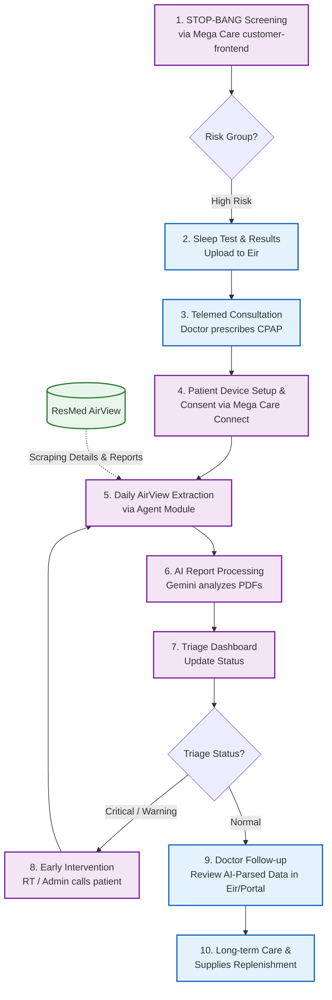

# Eir & Mega Care Ecosystem: Sleep Apnea Care Operation Flow

This document outlines the end-to-end patient journey for Sleep Apnea management, integrating **Eir** (Clinical & Patient Frontend), **Mega Care Connect** (Device & Consent Management), and **Mega Care Admin Portal** (Automated Extraction, AI Analysis, and Triage).

## 1. System Architecture & Synergy
*   **Eir:** Handles Sleep Test appointments, Telemedicine, and follow-up clinical consultations.
*   **Mega Care Connect (Customer Frontend/Service):** Manages patient screening (STOP-BANG), customer records, device registration (e.g., CPAP serial numbers), and patient consent. Source of truth for device ownership and initial triaging score.
*   **Mega Care Admin Portal:** Automatically extracts data from ResMed AirView using Playwright agents, processes PDF reports using Gemini 2.5 Flash-lite AI, and provides a Triage Dashboard for early intervention.

## 2. Operation Flow

### Phase 1: Screening & Diagnosis
1.  **STOP-BANG Screening (Mega Care Connect):** Patients complete the STOP-BANG assessment via Mega Care's `customer-frontend` portal. The `customer-service` backend calculates the risk score. High-risk patients are prompted to book a Sleep Test with Eir.
2.  **Sleep Test (Eir):** The patient undergoes a Home Sleep Test or in-lab test. Results are uploaded to Eir.
3.  **Telemed Consultation (Eir):** A doctor reviews the STOP-BANG score (passed from Mega Care Connect) and Sleep Test results via Eir Telemed and prescribes CPAP therapy.

### Phase 2: Device Onboarding & Sync (Mega Care Connect)
4.  **Device Setup & Consent:** The patient receives the CPAP machine, registers the device, and provides data consent through **Mega Care Connect**. The device status changes to `Linked` in the Admin Portal.

### Phase 3: Automated Monitoring & AI Analysis (Mega Care Admin Portal)
5.  **Daily AirView Extraction (Agent Module):** The `agent` module within Mega Care Admin Portal runs an automated Playwright script that triggers a bulk workflow daily to extract the Patient List, Detail Reports, and Compliance Reports from ResMed AirView.
6.  **AI Report Processing:** The extracted PDF reports are sent to the `gemini-2.5-flash-lite` model. The AI parses the data into JSON, extracting key metrics (AHI, Leak, Usage) and generating `analysis_and_recommendations`.

### Phase 4: Triage & Early Intervention (Mega Care Admin Portal)
7.  **Triage Dashboard Update:** The Admin Portal's Triage Dashboard automatically updates patient statuses to **Critical (Red)**, **Warning (Yellow)**, or **Normal (Green)** based on the AI's analysis.
8.  **Early Intervention:** For patients marked as Critical or Warning (e.g., CPAP usage < 4 hours, high mask leak), the Respiratory Therapist (RT) or Admin receives a task alert and proactively contacts the patient to offer assistance.

### Phase 5: Doctor Follow-up & Long-term Care (Eir)
9.  **Doctor Follow-up:** During the 14-day or 30-day follow-up consultation on Eir, the doctor reviews the AI-generated summary report (AHI, compliance, AI recommendations) instead of raw PDFs, enabling a faster and more accurate consultation.
10. **Long-term Maintenance:** Eir's automated system sends reminders for consumable replacements (masks, filters, hoses) every 3-6 months and schedules annual check-ups.

## 3. Visual Workflow

