# Cross-Tenant Multi-Agent Underwriting Architecture

This document outlines the architectural design for a multi-agent workflow where medical documents are analyzed in the Medical tenant and the structured results are securely passed to the Insurance tenant for underwriting decisions.

## Goal

Design an end-to-end Agentic Pipeline using Bifrost, Syn, Eir, and A2A (Agent-to-Agent) Protocol to automate the extraction of patient records and execute underwriting logic across isolated tenants (`asgard_medical` and `asgard_insurance`).

> [!NOTE]
> This architecture leverages Bifrost's A2A Protocol to maintain strict tenant isolation. Medical records remain in the `asgard_medical` scope, while the underwriting logic and risk thresholds remain securely in the `asgard_insurance` scope.

---

## 🤖 Agent Design & Roles

To fulfill the complete pipeline, we design **3 Core Agents** operating across 2 tenants.

### 1. 🏥 Medical Review Agent (Tenant: `asgard_medical`)
**Role:** Document Extraction & Medical Reasoning
- **Tools Equipped:**
  - `syn_ocr_extract`: Calls Syn via Hermóðr to extract PDF into structured markdown.
  - `eir_fhir_careplan`: Calls Eir via Hermóðr to fetch the JSON FHIR Care Plan.
  - `bifrost_a2a_dispatch`: Calls another agent (The Underwriting Agent) securely.
- **System Prompt / Task:** 
  - Receive PDF. Extract text. Fetch FHIR Care Plan.
  - Compare lab results (e.g., HbA1c, LDL) and patient compliance against the Care Plan goals.
  - Structure the findings into a standard JSON payload (Underwriting Feature Vector).
  - Use `bifrost_a2a_dispatch` to send this structured, de-identified payload to the Insurance Agent.

### 2. 🏦 Insurance Underwriting Agent (Tenant: `asgard_insurance`)
**Role:** Actuarial Risk Scoring & Decision Making
- **Tools Equipped:**
  - `insurance_policy_rag`: Searches local Qdrant vectors for underwriting rules (e.g., boundaries, exclusions).
  - `core_insurance_stub`: (Optional) Mock tool to update an external insurance system (like eBao).
- **System Prompt / Task:**
  - You receive structured medical findings (e.g., HbA1c levels, known morbidities).
  - Apply strict underwriting rules (e.g., HbA1c > 6.5 triggers human review or premium loading).
  - Generate an "Underwriting Decision Report" indicating (Approve, Reject, Load Premium, Request Human-In-The-Loop).

### 3. ⚖️ Bifrost A2A Router (Platform Layer)
**Role:** Cross-Tenant Communication & Guardrails
- Automatically intercepts A2A calls.
- Enforces the **Skuggi PII Guardrail** (ensuring highly sensitive PHI like names or national IDs are redacted before crossing into the insurance underwriting scope, leaving only clinical data).

---

## 🔄 Orchestration Flow (A2A Sequence)

```mermaid
sequenceDiagram
    participant User as Doctor/Clerk
    participant MedAgent as Medical Review Agent (asgard_medical)
    participant Skuggi as Skuggi Guardrail
    participant InsAgent as Underwriting Agent (asgard_insurance)
    
    User->>MedAgent: อัปโหลด PDF ประวัติการรักษา
    
    rect rgb(20, 60, 40)
        Note over MedAgent: 1. Medical Extraction Phase
        MedAgent->>MedAgent: เรียก `syn_ocr_extract` (PDF -> Text)
        MedAgent->>MedAgent: เรียก `eir_fhir_careplan` (FHIR JSON)
        MedAgent->>MedAgent: วิเคราะห์เปรียบเทียบ (LLM)
    end
    
    MedAgent->>Skuggi: 2. ส่งต่อ (A2A Dispatch Payload)
    Skuggi->>Skuggi: Redact PII (ชื่อ, ที่อยู่) เหลือแค่ Clinical Data
    Skuggi->>InsAgent: Forward สู่ Insurance Tenant
    
    rect rgb(60, 30, 20)
        Note over InsAgent: 3. Underwriting Phase
        InsAgent->>InsAgent: เรียก `insurance_policy_rag` (เช็คเงื่อนไข)
        InsAgent->>InsAgent: ตัดสินใจตาม Risk Threshold
    end
    
    InsAgent-->>MedAgent: Return ผลการพิจารณาเบื้องต้น (Approve/Load/Decline)
    MedAgent-->>User: สรุปผลลัพธ์ทั้งหมดให้ User ทราบ
```

---

## User Review Required

> [!IMPORTANT]
> **PII Gating (Skuggi)**: The insurance tenant usually operates strictly on actuarial data. Do you want Skuggi to aggressively redact **all** Personal Identifiable Information (Names, IDs) before the payload hits the `asgard_insurance` tenant, or does the Underwriting Agent need specific identifiers to attach to a policy application?

> [!WARNING]
> **Human-in-the-Loop (HITL)**: For borderline cases (e.g. HbA1c exactly at the boundary of a loaded premium), should the Insurance Agent automatically halt and flag for a human Underwriter, or proceed with a recommendation?

## Open Questions

1. **A2A Permissions:** Are the two tenants allowed to communicate synchronously (waiting for the Insurance Agent to reply in real-time), or should this be an asynchronous hand-off (fire and forget)?
2. **Tools in Insurance Tenant:** Do we need to build mock tools for the Insurance Agent to submit the final decision to an external system (like eBao), or just return the text response?
