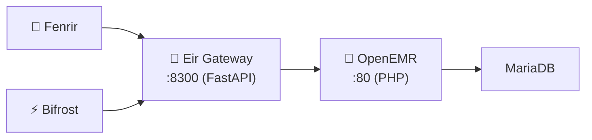

# SI-01: Software Implementation Report — Eir Gateway

**Product:** 🚪 Eir Gateway (FHIR R4 Proxy for OpenEMR)
**Document ID:** SI-RPT-EIR-GW-001
**Version:** 0.1.0
**Date:** 2026-03-18
**Standard:** ISO/IEC 29110 — SI Process
**Stack:** 🐍 Python (FastAPI) + 🏥 PHP (OpenEMR)

---

## 1. Product Overview

| Field | Value |
|:--|:--|
| **Repository** | MegaWiz-Dev-Team/Eir |
| **Ports** | `:80` (OpenEMR), `:8300` (Gateway) |
| **Containers** | `asgard_eir`, `asgard_eir_gateway` |
| **Dependencies** | MariaDB, OpenEMR |

---

## 2. Architecture

## 3. Functional Requirements

| FR | Description | Status |
|:--|:--|:--|
| FR-E01 | FHIR R4 proxy (Patient, Encounter, Observation) | ✅ Done |
| FR-E02 | Rate limiting | ✅ Done |
| FR-E03 | Response caching (TTL) | ✅ Done |
| FR-E04 | Auth token validation | ✅ Done |
| FR-E05 | Multi-tenant support | ✅ Done |

## 4. API Endpoints

| Method | Path | Description |
|:--|:--|:--|
| `GET` | `/healthz` | Health check |
| `GET` | `/apis/default/fhir/Patient` | FHIR Patient resource |
| `GET` | `/apis/default/fhir/Encounter` | FHIR Encounter resource |
| `GET` | `/apis/default/fhir/Observation` | FHIR Observation resource |

## 5. Configuration

| Variable | Default | Description |
|:--|:--|:--|
| `GATEWAY_PORT` | `8300` | Gateway port |
| `OPENEMR_URL` | `http://eir:80` | OpenEMR backend |
| `AUTH_ENABLED` | `false` | Enable token auth |
| `RATE_LIMIT_RPS` | `100` | Rate limit |
| `CACHE_TTL_SECS` | `60` | Cache TTL |
| `TENANT_ID` | `default` | Tenant identifier |

---

*บันทึกโดย: AI Assistant (ISO/IEC 29110 SI Process)*
*Created: 2026-03-18 by Antigravity*
