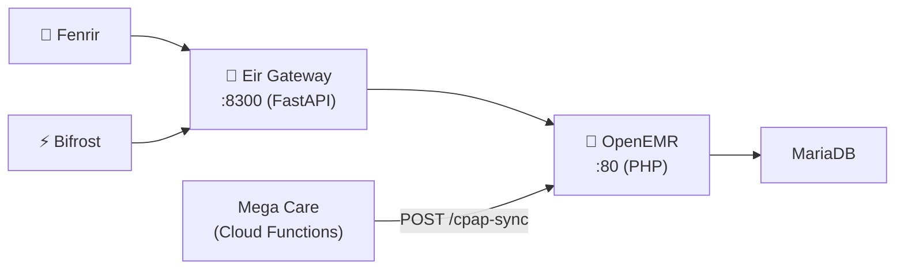

# SI-01: Software Implementation Report — Eir Gateway

**Product:** 🚪 Eir Gateway (FHIR R4 Proxy for OpenEMR)
**Document ID:** SI-RPT-EIR-GW-001
**Version:** 0.2.0
**Date:** 2026-03-23
**Standard:** ISO/IEC 29110 — SI Process
**Stack:** 🐍 Python (FastAPI) + 🏥 PHP (OpenEMR)

---

## 1. Product Overview

| Field | Value |
|:--|:--|
| **Repository** | MegaWiz-Dev-Team/Eir |
| **Ports** | `:80` (OpenEMR), `:8300` (Gateway) |
| **Containers** | `asgard_eir`, `asgard_eir_gateway` |
| **Dependencies** | MariaDB, OpenEMR |
| **Sites** | `sites/default/` (production), `sites/sandbox/` (testing) |

---

## 2. Architecture

## 3. Functional Requirements

| FR | Description | Status | Sprint |
|:--|:--|:--|:--|
| FR-E01 | FHIR R4 proxy (Patient, Encounter, Observation) | ✅ Done | S4 |
| FR-E02 | Rate limiting | ✅ Done | S4 |
| FR-E03 | Response caching (TTL) | ✅ Done | S4 |
| FR-E04 | Auth token validation | ✅ Done | S4 |
| FR-E05 | Multi-tenant support | ✅ Done | S4 |
| FR-E06 | CPAP Sync API (`POST /cpap-sync`) | ✅ Done | S5 |
| FR-E07 | LBF: CPAP Prescription form | ✅ Done | S5 |
| FR-E08 | LBF: Sleep Report Data form | ✅ Done | S5 |
| FR-E09 | Migration log (idempotent data migration) | ✅ Done | S5 |
| FR-E10 | Sandbox site for testing | ✅ Done | S5 |
| FR-E11 | Local deploy script (`scripts/deploy.sh`) | ✅ Done | S5 |

## 4. API Endpoints

| Method | Path | Description | Sprint |
|:--|:--|:--|:--|
| `GET` | `/healthz` | Health check | S4 |
| `GET` | `/apis/default/fhir/Patient` | FHIR Patient resource | S4 |
| `GET` | `/apis/default/fhir/Encounter` | FHIR Encounter resource | S4 |
| `GET` | `/apis/default/fhir/Observation` | FHIR Observation resource | S4 |
| `POST` | `/api/cpap-sync` | CPAP data sync from Mega Care | S5 |

## 5. Sprint 5 — New Components

### 5.1 CPAP Sync API

| Item | Detail |
|:--|:--|
| **Controller** | `src/RestControllers/CpapSyncRestController.php` |
| **Route** | `_rest_routes.inc.php` → `POST /api/cpap-sync` |
| **Tests** | `tests/Tests/RestControllers/CpapSyncRestControllerTest.php` (11 cases) |
| **Idempotency** | Via `migration_log` table (`idempotency_key` = `patient:type:doc`) |
| **Data Types** | `prescription`, `daily_report`, `compliance_report` |

### 5.2 Database Schema (SQL Migrations)

| File | Table/Form | Purpose |
|:--|:--|:--|
| `sql/migrations/001_migration_log.sql` | `migration_log` | Tracks migration status per-patient per-data-type |
| `sql/migrations/002_lbf_cpap_prescription.sql` | LBF `LBFcpap` | CPAP device, therapy settings, mask info |
| `sql/migrations/003_lbf_sleep_report.sql` | LBF `LBFsleep` | Usage, AHI, leak, pressure, triage, compliance |

### 5.3 Sandbox Environment

| Item | Path |
|:--|:--|
| **Config** | `sites/sandbox/sqlconf.php` → DB `openemr_sandbox` |
| **Seed (OpenEMR)** | `sql/seed/sandbox_mock_data.sql` (5 mock patients) |

### 5.4 Deployment

| Item | Detail |
|:--|:--|
| **Script** | `scripts/deploy.sh` |
| **Steps** | `git pull` → PHP lint → SQL migrations → Apache reload |
| **Modes** | `--site sandbox`, `--dry-run`, `--migrate-only` |
| **Migration Tracking** | `sql/.migrations_applied` (prevents re-running) |

## 6. Configuration

| Variable | Default | Description |
|:--|:--|:--|
| `GATEWAY_PORT` | `8300` | Gateway port |
| `OPENEMR_URL` | `http://eir:80` | OpenEMR backend |
| `AUTH_ENABLED` | `false` | Enable token auth |
| `RATE_LIMIT_RPS` | `100` | Rate limit |
| `CACHE_TTL_SECS` | `60` | Cache TTL |
| `TENANT_ID` | `default` | Tenant identifier |

---

## Change Log

| Version | Date | Changes |
|:--|:--|:--|
| 0.1.0 | 2026-03-18 | Initial: FHIR R4 proxy (FR-E01 to FR-E05) |
| 0.2.0 | 2026-03-23 | Sprint 5: CPAP Sync API, LBF forms, migration_log, sandbox, deploy script (FR-E06 to FR-E11) |

---

*บันทึกโดย: AI Assistant (ISO/IEC 29110 SI Process)*
*Created: 2026-03-18 by Antigravity*
*Updated: 2026-03-23 by Antigravity — Sprint 5 PDPA Consent Remediation*

